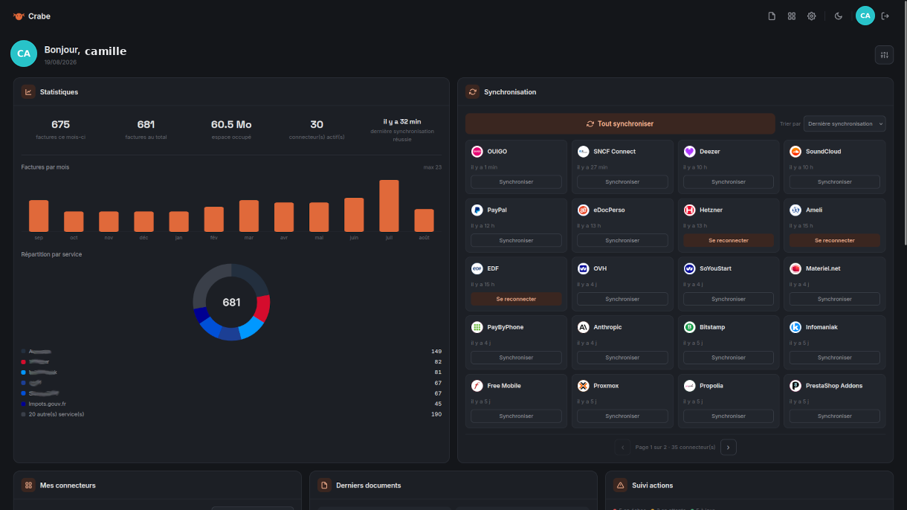
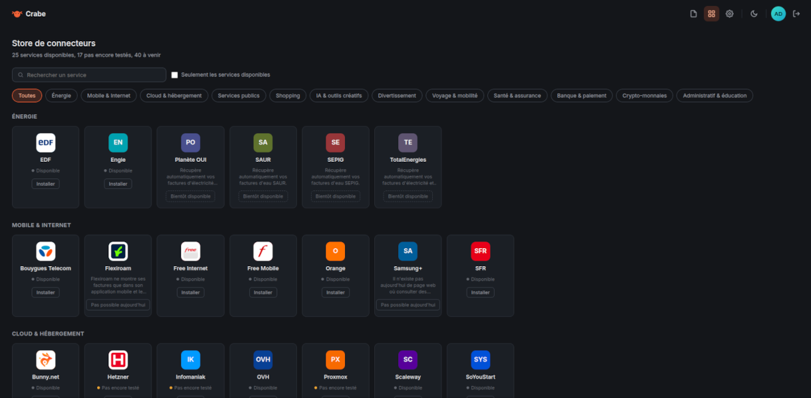
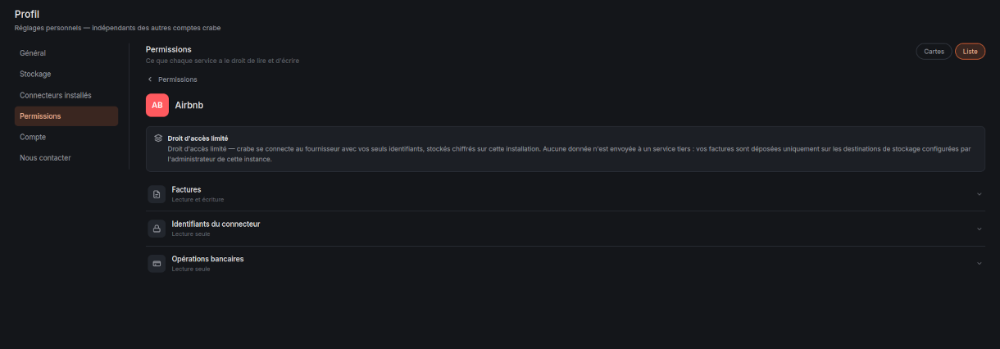
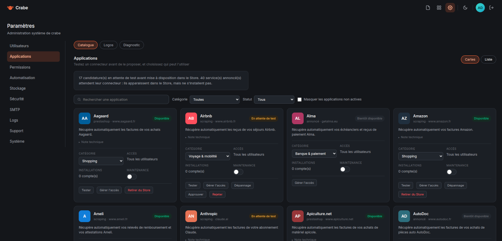
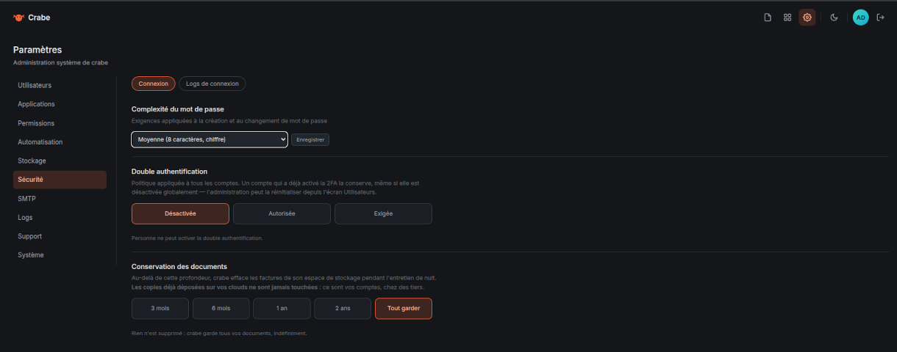
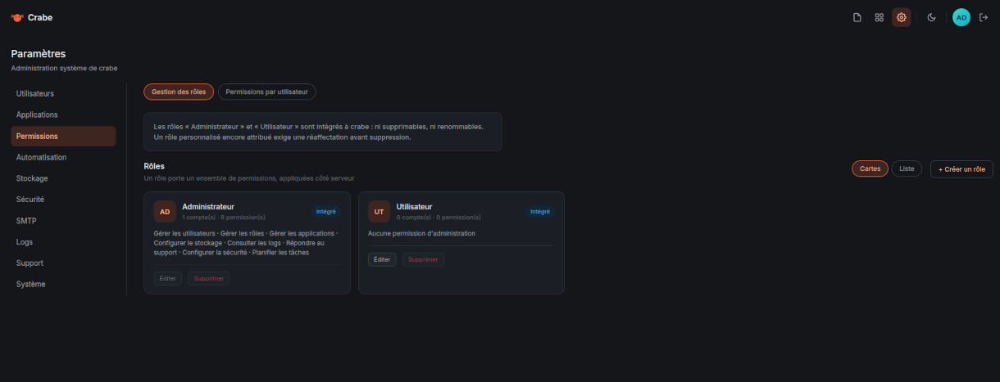

# 🦀 crabe

**Vos factures et vos documents, récupérés tout seuls, rangés chez vous.**

> **Version bêta.** crabe fonctionne, mais il est jeune : les connecteurs sont
> ajoutés et affinés petit à petit, au rythme des sites réels. Certains
> récupèrent déjà vos documents, d'autres savent seulement lire votre liste de
> commandes, et quelques-uns attendent encore d'être écrits — chaque fiche dit
> où elle en est. Attendez-vous à ce que ça bouge, et à ce qu'un site change
> ses pages du jour au lendemain.
>
> **Il vous manque un service ?** Ouvrez une
> [issue](https://github.com/TheWorms/crabe/issues) en indiquant le site
> concerné et le type de document que vous voudriez récupérer (facture, reçu,
> billet…). Les demandes orientent l'ordre dans lequel les connecteurs sont
> écrits.

crabe va chercher vos factures et vos attestations sur les sites où vous avez
un compte — opérateur, banque, énergie, boutiques, services en ligne — et les
range au même endroit : votre disque, votre NAS, votre cloud. Un dossier par
service, un sous-dossier par compte, un par année. Vous ne les téléchargez
plus un par un, et vous ne les cherchez plus.

crabe tourne **chez vous**. Aucun de vos identifiants ne quitte votre machine,
aucun document ne transite par un serveur qui ne serait pas le vôtre. Il n'y a
pas de compte crabe, pas d'abonnement, pas de service central : il n'y a que le
logiciel, votre machine, et les sites que vous lui désignez.



---

## Ce que crabe fait

- Il se connecte aux services que vous avez choisis, avec les identifiants que
  vous lui confiez ou une session que vous ouvrez vous-même dans une fenêtre.
- Il télécharge ce qui est disponible : factures, relevés, attestations,
  bulletins.
- Il range chaque document sous `<vous>/<Service>/<compte>/<année>/`.
- Il recopie le tout vers les espaces de stockage que vous branchez : un
  dossier local, un NAS, un cloud (pCloud, Proton Drive, Nextcloud, Dropbox,
  S3 — tout ce que sait joindre rclone).
- Il repasse tout seul, à la fréquence que vous fixez, et vous prévient par
  courriel s'il n'a pas pu.

## Ce que crabe ne fait pas

- **Il n'invente rien.** Quand un site ne fournit pas de PDF — c'est le cas de
  beaucoup —, crabe le dit clairement au lieu de fabriquer un document et de le
  faire passer pour officiel.
- **Il ne contourne rien.** Un site protégé par un anti-robot reste fermé, et
  crabe l'annonce. Il n'insiste jamais sur un formulaire de connexion : deux
  essais ratés font bloquer un compte.
- **Il n'envoie rien nulle part.** Pas de télémétrie, pas de statistiques, pas
  d'appel à un serveur d'éditeur. La seule requête sortante qui ne concerne pas
  vos services est la vérification de mise à jour — coupée par défaut (voir
  plus bas).
- **Ce n'est pas un coffre-fort légal.** C'est un ramasseur et un rangeur. Vos
  documents restent des fichiers, dans des dossiers, que vous pouvez lire sans
  crabe et emporter le jour où il ne vous plaît plus.

---

## Démarrer

Il vous faut Docker. Trois commandes :

```bash
mkdir crabe && cd crabe
curl -O https://raw.githubusercontent.com/TheWorms/crabe/main/docker-compose.yml
docker compose up -d
```

### Le premier écran vous appartient

Ouvrez **http://localhost:3000**. crabe vous accueille en vous demandant de
créer votre compte : un identifiant, un mot de passe, et vous êtes dedans.

Ce compte est celui de l'administrateur — c'est vous. L'écran de création
n'existe qu'à ce moment-là : dès qu'un compte existe, il disparaît pour
toujours, et personne ne peut s'inscrire à votre place. Il n'y a pas
d'inscription publique dans crabe ; les comptes suivants, si vous en voulez,
c'est vous qui les créez depuis les réglages.

<!-- TODO capture : l'écran « Bienvenue », création du premier compte -->

Ces identifiants ne servent qu'à ouvrir crabe. Ils n'ont aucun rapport avec
vos comptes chez les services, et ils ne sortent pas de chez vous.

### Puis notez la phrase secrète

```bash
docker compose logs crabe
```

Au tout premier démarrage, crabe a généré sa **phrase secrète** et l'a dite
une seule fois dans ses journaux, dans un encadré. Elle chiffre tous les
identifiants que vous enregistrerez, et elle est écrite dans
`data/phrase-secrete` : si vous sauvegardez le dossier `data`, vous la
sauvegardez avec.

Pour une installation automatisée (ou si vous préférez tout fixer d'avance),
posez ces variables avant le premier démarrage — le compte est alors créé au
lancement et l'écran d'accueil ne s'affiche jamais :

```yaml
environment:
  CRABE_ADMIN_USERNAME: "camille"
  CRABE_ADMIN_PASSWORD: "un-mot-de-passe-a-vous"
  CRABE_MASTER_PASSPHRASE: "une-phrase-longue-et-privee"
```

---

## Brancher un premier service

Dans **Connecteurs**, choisissez un service dans la liste, puis **Installer**.

Ce que crabe demande dépend du service, et il vous le dit :

- **Un identifiant et un mot de passe** pour les sites qui s'en contentent. Ils
  partent chiffrés dans la base, avec la phrase secrète.
- **Une clé d'API**, quand le service en propose une : c'est toujours le
  meilleur choix, elle se révoque d'un clic et ne donne accès qu'à ce qu'elle
  déclare.
- **Une fenêtre de connexion**, pour les sites qui envoient un code par SMS ou
  par courriel, ou qui passent par « connexion avec Google ». crabe ouvre alors
  une vraie fenêtre de navigateur dans votre navigateur. Vous vous connectez
  vous-même, exactement comme d'habitude, et **vous cliquez « Enregistrer »
  quand vous êtes arrivé sur votre compte**.

  Ce clic est important : c'est lui qui dit à crabe « ça y est, je suis
  connecté, prends la session ». Cliquer trop tôt ne capture rien d'utile, et
  crabe vous le fera remarquer plutôt que de vous laisser croire que c'est fait.

<!-- TODO capture : la fenêtre de connexion, avec le bouton « Enregistrer » -->

Ensuite : **Récupérer**. crabe part chercher, et raconte ce qu'il trouve.

---

## Où vont les documents

Par défaut, dans le dossier `data/documents` de votre installation. C'est déjà
un rangement complet, et ça peut suffire.

Dans **Destinations**, vous pouvez en ajouter d'autres : un montage réseau, un
cloud. Chaque document neuf part vers **tous** les espaces actifs en même
temps — ce ne sont pas des sauvegardes en cascade, ce sont des copies
parallèles. crabe refuse d'éteindre le dernier espace restant, et vous dit
pourquoi.

L'arborescence est la même partout, pour que vous vous y retrouviez sans
crabe :

```
camille/
  Free Internet/
    fbx12345678/
      2025/
        2025-11_facture.pdf
      2026/
  eDocPerso/
    ...
```

---

## Sécurité, franchement

- **La phrase secrète chiffre vos identifiants.** Sans elle, ils sont
  irrécupérables — pas « difficiles à retrouver » : perdus. C'est le prix du
  chiffrement réel. Sauvegardez `data/`, ou fixez-la vous-même avec
  `CRABE_MASTER_PASSPHRASE` pour la tenir hors du volume.
- **Une session capturée vaut vos identifiants** tant qu'elle est valide. Elle
  est chiffrée comme le reste, et crabe n'emporte que les cookies du domaine
  concerné — jamais votre session Google au passage.
- **Le conteneur ne tourne pas en root.** L'application vit sous un utilisateur
  sans privilège, et le port n'écoute que ce que vous publiez.
- **crabe ne fait pas de HTTPS lui-même.** Il sert du HTTP en clair sur son
  port. Sur votre machine ou votre réseau domestique, c'est sans conséquence.
  Si vous l'exposez au-delà, mettez un reverse proxy avec un vrai certificat
  devant — et activez la double authentification depuis votre profil.
- **Confiez-lui ce qui vous met à l'aise.** Un service qui propose une clé
  d'API limitée mérite qu'on l'utilise plutôt qu'un mot de passe principal. Une
  banque mérite peut-être qu'on n'y touche pas du tout. crabe ne vous poussera
  jamais dans un sens ou dans l'autre.
- **Ce logiciel est jeune** et pilote de vrais navigateurs sur de vrais
  comptes. Les sites changent sans prévenir, un connecteur peut cesser de
  marcher du jour au lendemain. Quand c'est le cas, crabe le dit — il ne prétend
  pas avoir réussi.

---

## Configurer

Rien n'est obligatoire pour démarrer. Toutes les variables sont documentées
dans [`.env.example`](.env.example) : envoi de courriel, fuseau, dossier de
données, phrase secrète et compte administrateur imposés.

### Mise à jour

crabe **ne se met jamais à jour tout seul**. Il peut en revanche vous prévenir
qu'une version existe, si vous le lui demandez. Dans le compose :

```yaml
environment:
  CRABE_UPDATE_REPO: "TheWorms/crabe"
```

Une consultation par jour au maximum, rien d'envoyé, et un bandeau discret si
une version plus récente est publiée. Variable vide ou absente : aucune requête.

Pour mettre à jour, quand vous le décidez :

```bash
docker compose pull && docker compose up -d
```

Vos données sont dans le volume, elles ne bougent pas. Les changements de base
s'appliquent au démarrage.

---

## À quoi ça ressemble

Le Store, où chaque service annonce honnêtement son état — disponible, pas
encore testé, ou impossible aujourd'hui (et pourquoi) :



Ce que chaque connecteur a le droit de lire et d'écrire, dit en français :



Et côté administration — le catalogue, la politique de sécurité, les rôles :







---

## Contribuer

Les connecteurs sont des fichiers autonomes : un `manifest.json` qui décrit ce
que le service demande, un `connector.js` qui va chercher. En ajouter un ne
demande pas de toucher au reste.

La règle du projet tient en une phrase : **une réponse n'est pas une preuve,
c'est son contenu qui en est une.** Un connecteur qui reçoit un code 200 n'a
rien prouvé tant qu'il n'a pas vu la liste des documents. Un fichier téléchargé
n'est un PDF que si ses premiers octets le disent. Les notes techniques des
manifestes existants montrent le niveau de mesure attendu — elles racontent ce
qui a été observé, pas ce qui devrait marcher.

Ouvrez une *issue* avant un gros morceau, qu'on en parle.

---

## Licence

[AGPL-3.0-only](LICENSE). Vous pouvez l'utiliser, l'étudier, le modifier et le
redistribuer. Si vous le proposez comme service à d'autres, vous devez leur
donner accès à votre version modifiée. C'est délibéré : un logiciel qui
manipule les identifiants de ses utilisateurs doit rester lisible par eux.
